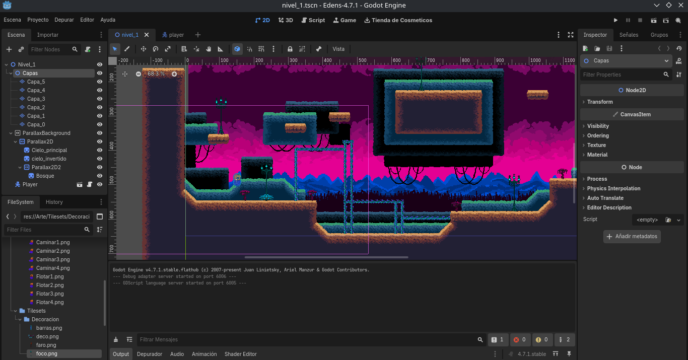

# 🎮 Eden's: Pixel Art V4.7.1

  
> Eden's es una plantilla open-source pensada para que desarrolladores indie de Godot puedan crear su propio **Metroidvania en pixel art**

---

## 📦 Eden's

Eden's es un proyecto **demostrativo** —un esqueleto completo de un juego Metroidvania en 2D con estilo pixel art— creado con **Godot 4.7.1**  
Esta pensado para que **cualquier dev**, sin importar su nivel, pueda:

- Aprender Godot Engine.
- Modificar, expandir y crear su propio juego.
- Colaborar con la comunidad y mejorar el proyecto.
---

## 🚀 Caracteristicas de la plantilla

- 📦 **Pixel art original** (personaje, tilesets basicos)
- 📦 **Movimiento del personaje** (salto, movimientos)
- 📦 **Estructura clara y comentada** para facilitar modificaciones.
- 📦 **Listo para GitHub y colaboracion**.

---
